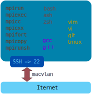

# Custome OpenMPI build for docker


## Hosts
### Example of Hosts file
```
192.168.1.2 node1
192.168.1.3 node2
192.168.1.4 node3
192.168.1.5 node4
```

## Instalation
You have to have a `hosts` file for make to run.
You have to have a SSL key for make to run.

Use make file with task in order:
1. `make sshkey`
2. `make build`
3. `make run`

## Uninstall
Use make file with task in order:
1. `make clean`
